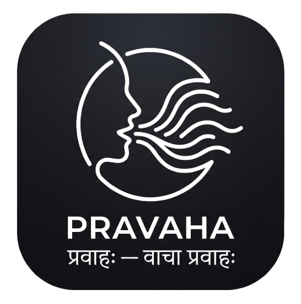

<div align="center">



# Pravāha (प्रवाह)
### Offline Speech Therapy & Fluency Companion

[](https://flutter.dev)
[](https://dart.dev)
[](https://flutter.dev)
[](LICENSE)
[](https://github.com/HarshitWaldia/Pravaha)

<p align="center">
  <b>Find your natural speech cadence. Zero cloud API keys. Zero subscriptions. 100% privacy-first and offline.</b>
</p>

</div>

---

## Overview

**Pravāha (प्रवाह)** is an evidence-based speech therapy, stuttering management, and articulation training mobile application. It provides clinically structured motor speech conditioning, real-time visual and rhythmic biofeedback, and progressive difficulty ladders to help individuals who stutter, experience speech blocks, or want to improve speech clarity.

All audio processing, visual biofeedback, and progress tracking run completely on-device without requiring any internet connection.

---

## Targeted Trouble Sound Mastery (S, CH, F, P)

Pravāha includes dedicated phonetic progression ladders specifically designed to overcome speech blocks on difficult initial consonants and consonant blends:

| Sound Module | Phonetic Class | Breakdown Sample | Target Mechanics |
|:---|:---|:---|:---|
| **The "S" Sound** | Sibilant Alveolar Fricative | `Sssss — un` / `Meh — ssss — ee` / `Sssss — poon` | Continuous airflow channels without tongue-jamming blocks |
| **The "CH" Sound** | Postalveolar Affricate | `T-S-H — air` / `Kih — tsch — en` / `Tsch — ip — sssss` | Crisp palate release without dragging into "SH" |
| **The "F" Sound** | Labiodental Fricative | `Ffffff — an` / `Caw — ffffff — ee` / `Ffffff — rog` | Light incisor-on-lip contact without hard bite tension |
| **The "P" Sound** | Bilabial Plosive | `P! — en` / `h-P! — ool` / `P! — a — ssss — p! — ort` | Feather-light lip seal and effortless pop without glottal locking |

---

## 32+ Clinical Exercises Across 6 Modules

### 1. Articulation & Precision Practice
* **The Bite Block Reader**: Dual 60s obstructed/free reading timer for effortless jaw opening and enunciation.
* **Plosive Explosion Drills**: Rapid 10s intervals for P $\rightarrow$ T $\rightarrow$ K $\rightarrow$ B consonant bursts.
* **Front-to-Back Tongue Alternation**: Rapid motor switching between T-K and P-K syllable pairs.
* **Consonant-Vowel Phoneme Ladders**: Cardinal vowel ladders across difficult consonant sounds.
* **Exaggerated Jaw Drops**: Masseter muscle stretching to counteract closed-mouth tension.
* **Dental-Labial Shifts**: 30-second rapid tooth-to-lip agility drills (F-P).

### 2. Oral Motor Conditioning
* **Tongue Roof-Press**: 5s hold / 2s rest lingual-base isometric strengthening.
* **Inside-Cheek Resistance Pushes**: Lateral tongue stability with finger resistance.
* **Tongue Tip Circles**: Full circumduction for range-of-motion and lubrication.
* **Fish Face to Wide Smile Shift**: Rapid alternating lip pucker and zygomaticus stretch.
* **Alveolar Ridge "Spot" Tap**: Independent tongue-tip elevation without jaw movement.
* **The Lip Pop**: Intraoral air pressure buildup and clean bilateral seal release.

### 3. Breath Support & Vocal Volume
* **Diaphragmatic Belly Book Balance**: 2-minute calming diaphragmatic breath training.
* **Hissing Resistance Exhale**: Stopwatch with automated **Personal Best** tracking.
* **Pitch Glissando / Siren**: Full dynamic range pitch glides on "Oooo".
* **Volume Escalator (1 to 5)**: Step up diaphragmatic projection (Whisper $\rightarrow$ Soft $\rightarrow$ Conversational $\rightarrow$ Boardroom $\rightarrow$ Presentation).
* **Wall-Sit "Ah" Sustenance**: Core-anchored subglottic breath support.

### 4. Fluency, Pacing & Rhythm
* **Finger Syllable Tapping**: Multi-modal rhythmic motor pacing (40–120 BPM).
* **Paused Phrase Chunk Check**: 3–4 word chunked reading with deliberate resting pauses.
* **Easy Onset Breathed Phrases**: Vocal fold abduction training with soft "hhhh-" prefix.
* **Continuous Phonation Legato**: Unbroken vocal resonance across word boundaries.

### 5. Cognitive-Linguistic & Word Finding
* **Rapid Convergent Naming**: Top-down semantic umbrella category challenges.
* **Divergent Category Sprint**: 60-second rapid lexical retrieval sprint (15+ items).
* **Word Association Chains**: Continuous 20-word associative momentum chains.
* **Alphabetical Object Hunt**: Interactive 26-letter A-Z environmental scanner grid.
* **5-Attribute Object Description**: Rapid adjective retrieval and sentence assembly checklist.

### 6. Stuttering Modification / Van Riper Techniques
* **Preparatory Sets (Pre-Blocks)**: Anticipate difficulty and configure articulators into relaxed posture.
* **Pull-Outs (Ease-Outs)**: Voluntarily ease and slide out of active blocks mid-utterance.
* **Cancellations**: Post-block pause, reflection, and fluent re-production.
* **Light Articulatory Contacts**: Feather-light consonant touch to reduce oral muscle tension.
* **Prolongation (Stretched Speech)**: Syllable elongation with auditory feedback.
* **Progressive Speech Muscle Relaxation**: Somatic tension-and-release cycles for jaw, tongue, and neck.

### 7. Real-World Speaking Scenarios
* **Ordering at a Cafe**: Time-pressured ordering dialogue with strategy coaching.
* **Answering a Phone Call**: Self-introduction and date/time clear enunciation.
* **Group Self-Introduction**: Social composure and breathing management.

---

## Interactive Practice Screen Engines

Pravāha includes 6 purpose-built offline practice screen engines:

* **`TimedExerciseScreen`**: Circular countdown progress ring, split-phase transitions, and soothing breath palettes.
* **`RepCounterScreen`**: Tap-to-count repetitions, automated 5s hold / 2s release state machines with haptic cues, and 5-attribute checklists.
* **`StopwatchScreen`**: Millisecond precision airflow timers with historical Personal Best persistence.
* **`StepperExerciseScreen`**: Multi-stage volume & plosive drills with stage timers and auto-advancement.
* **`WordProgressionScreen`**: Sound-specific word ladder trainer with phonetic cards, clinical tips, and instant audio playback.
* **`AlphaGridScreen`**: Interactive 26-letter responsive A-Z object hunt grid with skip actions.

---

## Architecture & Tech Stack

* **Framework**: Flutter 3.29 / Dart 3.7
* **Rendering Engine**: Impeller (Vulkan backend on Android)
* **Architecture**: Clean Architecture with Feature-First Modular Structure
* **Audio Engine**: `record: ^6.0.0` (AAC/M4A local recording) & `audioplayers: ^6.1.1`
* **Local Persistence**: `shared_preferences: ^2.3.5` (100% offline, zero network telemetry)
* **Design System**: Material 3 with calming deep teal (`#006A6A`), sage slate, and high-legibility typography.

```text
lib/
├── core/
│   ├── data/             # Exercise library & sound progression databases
│   ├── models/           # Domain models (Exercise, Session, Scenario)
│   ├── services/         # Audio recording/playback & local storage persistence
│   └── theme/            # Material 3 theme, tokens, & typography
└── features/
    ├── home/             # Daily progress streak & technique quick-start cards
    ├── practice/         # 6 specialized interactive practice screen engines
    └── progress/         # Recordings library, tension/confidence history & stats
```

---

## Getting Started

### Prerequisites
* Flutter SDK (3.27+ or 3.29+)
* Android SDK (API 35 supported) & Java 17

### Installation
1. Clone the repository:
   ```bash
   git clone https://github.com/HarshitWaldia/Pravaha.git
   cd Pravaha
   ```

2. Install dependencies:
   ```bash
   flutter pub get
   ```

3. Run on a connected Android/iOS device:
   ```bash
   flutter run
   ```

### Building Release APK
To generate an optimized, standalone release APK:
```bash
flutter build apk --release
```
The output APK is generated at:
`build/app/outputs/flutter-apk/app-release.apk`

---

## Privacy

Pravāha is strictly **100% offline**:
* No voice data ever leaves your device.
* Audio recordings are saved locally in the app's sandboxed storage directory.
* No accounts, trackers, or cloud analytics are used.

---

## Author

**Harshit Waldia**
* GitHub: [@HarshitWaldia](https://github.com/HarshitWaldia)
* Organization: Waldia

---

## License

This project is licensed under the MIT License - see the [LICENSE](LICENSE) file for details.
